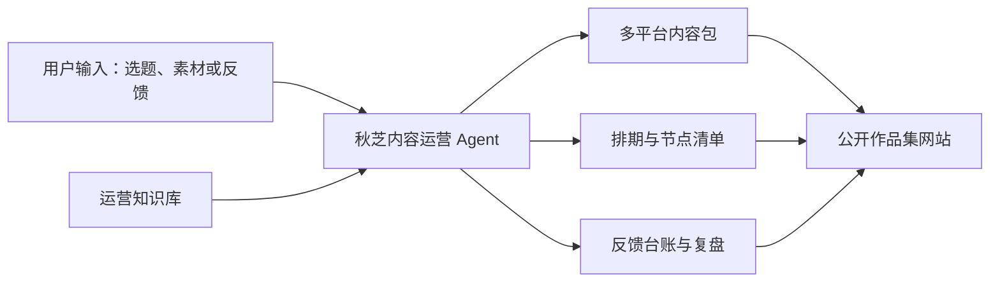

# 秋芝 AI 内容运营 Agent 与作品集网站设计

- 日期：2026-07-21
- 状态：已完成对话确认，等待书面规格审阅
- 使用场景：求职面试与作品集展示

## 1. 项目目标

为应聘“秋芝2046”团队的内容运营岗位制作一套可验证的作品集系统。系统同时包含：

1. 可在 Codex 中调用的内容运营 Agent；
2. 支撑 Agent 的结构化运营知识库；
3. 一套从选题到复盘的完整模拟案例；
4. 一个无需登录即可访问的公开作品集网站。

该系统用于证明候选人能够完成以下岗位工作：

- 协助抖音、B站、小红书、公众号和视频号的内容发布与基础维护；
- 整理用户反馈、评论、私信和运营数据，形成可追溯记录；
- 配合活动、社群和招聘传播，管理执行节点；
- 熟练使用表格、文档和 AI 工具提升工作效率。

## 2. 账号研究基线

项目以公开信息为依据，不使用或声称拥有账号后台数据。

截至 2026-07-21，B站公开搜索结果显示：

- 账号名称：秋芝2046；
- 账号主张：“让更多人用好AI”；
- 内容方向：AI 工具、Agent、Codex、Claude Code 等面向普通用户的实操教程；
- 常见内容特征：从零开始、保姆级、完整文档、真实任务演示和明确收藏价值；
- 公开页面：[秋芝2046的B站空间](https://space.bilibili.com/385670211)；
- 代表内容：[Codex 保姆级教学](https://www.bilibili.com/video/BV1Nd596vEyU)、[Claude Code 保姆级教学](https://www.bilibili.com/video/BV1NvRyBzEhq)、[从零做一个 Agent](https://www.bilibili.com/video/BV1KSKwzJEEV)。

粉丝数、视频数和单条内容互动量属于动态数据。网站引用时必须注明“查询日期”，不得将查询结果描述为长期固定事实。

## 3. 目标用户与成功场景

### 3.1 主要用户

- 面试官或招聘者：快速判断候选人是否理解账号及岗位；
- 候选人本人：通过公开网站讲解方法，并在 Codex 中现场演示；
- 作品集访客：无需安装工具即可浏览完整案例和方法。

### 3.2 核心演示路径

1. 面试官先通过公开网站了解项目背景和账号洞察；
2. 候选人展示模拟案例的选题、生产、发布、反馈和复盘闭环；
3. 面试官提出一个新的 AI 选题；
4. 候选人在 Codex 中调用 Agent，现场生成选题卡或多平台内容包；
5. 候选人展示 Agent 如何保留依据、待确认项和发布前检查项。

## 4. 范围与非目标

### 4.1 本期范围

- 一个静态、响应式、可公开访问的作品集网站；
- 一个可自动发现并调用的 Codex Skill；
- Markdown 格式的知识库与模板；
- JSON 或 CSV 格式的模拟台账数据；
- 一套全新的 AI 教程模拟案例；
- 三分钟面试演示脚本。

### 4.2 非目标

- 不接入秋芝2046的真实账号、私信、评论或后台数据；
- 不自动登录、发布、评论、点赞或发送私信；
- 不在公开网站中调用付费模型 API；
- 不建设数据库、用户系统或多人协作后台；
- 不冒充秋芝2046官方项目或真实团队成员。

## 5. 系统架构

系统采用“静态展示层 + 本地 Agent 层 + 知识层”的结构。



### 5.1 公开作品集网站

负责展示账号理解、工作方法、知识库索引、模拟案例、数据看板和现场演示指令。网站为预生成静态内容，不承担实时 AI 推理。

### 5.2 Codex Agent

以可复用 Skill 的形式存在。它读取知识库，根据用户输入执行选题分析、多平台改写、排期、反馈整理、运营复盘和节点检查。

### 5.3 运营知识库

保存账号画像、平台打法、内容生产 SOP、反馈管理规范、活动节点规则、审核清单和输出模板。详细知识按需加载，避免 Agent 每次读取全部资料。

## 6. 知识库设计

### 6.1 账号画像

记录：

- 核心定位与受众；
- 内容支柱与选题边界；
- 标题、开场、解释方式和行动引导的风格特征；
- 不应模仿或使用的表达；
- 公开事实、合理推断和模拟设定的标记规范。

### 6.2 平台打法

分别维护五个平台的输出规范：

| 平台 | 主要内容形态 | Agent 重点输出 |
| --- | --- | --- |
| B站 | 8—15 分钟完整教程 | 标题、封面字、大纲、章节、口播与简介 |
| 抖音 | 30—90 秒短视频 | 三秒钩子、口播、镜头、字幕重点与互动引导 |
| 视频号 | 30—90 秒知识短视频 | 克制开场、场景价值、口播、转发引导 |
| 小红书 | 图文或短视频笔记 | 痛点标题、卡片结构、正文、关键词和评论引导 |
| 公众号 | 深度教程 | 摘要、分级标题、完整步骤、注意事项和资料路径 |

平台规范以结构和检查项为主，不依赖容易过期的固定字符数；涉及最新平台限制时，Agent 必须先核验公开规则。

### 6.3 内容生产 SOP

标准流程为：

1. 趋势发现；
2. 选题评分；
3. 资料核验；
4. 主内容大纲；
5. 平台适配；
6. 发布前审核；
7. 内容排期；
8. 反馈收集；
9. 数据复盘；
10. 将结论回写选题库。

### 6.4 运营台账

知识库提供以下字段规范和模板：

- 内容日历：内容编号、平台、标题、负责人、状态、计划时间、实际时间、素材链接和备注；
- 用户反馈：来源、内容编号、反馈原文、匿名化文本、情绪、需求标签、优先级、处理状态和后续动作；
- 活动节点：项目、节点、负责人、截止时间、依赖项、交付物、状态和风险；
- 运营复盘：目标、结果、指标、异常、用户洞察、有效动作、无效动作和下一步实验。

### 6.5 审核规则

- 产品名称、功能、价格和发布日期必须有来源；
- 未验证信息使用“待核验”标记；
- 账号公开事实注明查询日期；
- 模拟评论、私信和数据明确标记“模拟”；
- 不输出无来源的绝对化结论；
- 不在公开材料中保留手机号、邮箱、微信号等个人信息。

## 7. Agent 能力与交互

Agent 提供六类核心任务：

1. `分析选题`：生成受众、痛点、价值、差异化、风险和评分；
2. `生成多平台内容包`：围绕同一主题输出五个平台的差异化内容；
3. `制定发布排期`：生成预热、首发、二次分发和复盘节点；
4. `整理用户反馈`：去重、匿名化、情绪判断、需求归类和优先级排序；
5. `生成运营复盘`：区分事实、假设和建议，提出下一轮实验；
6. `检查活动节点`：识别遗漏、依赖、临期事项和风险。

### 7.1 通用输入

- 任务类型；
- 选题或素材；
- 目标平台；
- 目标用户；
- 截止时间；
- 已知来源；
- 需要遵守的限制。

### 7.2 通用输出

每次输出固定包含：

- 可直接执行的主体内容；
- 使用的依据；
- 待确认项；
- 发布前检查清单；
- 建议保存到哪一种台账。

### 7.3 信息不足时的行为

- 模糊选题：先生成选题卡，不直接声称已形成发布稿；
- 缺少目标平台：询问平台，或默认输出 B站主内容与四平台分发摘要并注明默认项；
- 缺少事实来源：保留占位性的“待核验信息”，不得补写具体数据；
- 涉及新产品或新功能：先检索公开资料并记录查询日期；
- 涉及敏感私信：先匿名化，再分类和总结。

## 8. 模拟案例设计

案例主题为：

> 不用每天憋周报：让桌面 Agent 自动整理工作记录，5 分钟生成日报和周报

### 8.1 选题理由

- 面向职场小白，问题具体；
- 展示“AI 真正干活”，而不只介绍概念；
- 适合真实操作和步骤式教程；
- 可自然形成长视频、短视频、图文和长文；
- 与账号“从零开始、保姆级、可收藏”的内容方法一致。

### 8.2 案例交付内容

- 选题评分卡与公开趋势观察；
- 8—12 分钟 B站视频策划；
- 60 秒抖音和视频号口播及分镜；
- 小红书八页图文卡片；
- 公众号深度教程；
- 七天内容排期；
- 模拟评论与私信数据集；
- 模拟运营看板；
- 复盘结论和下一期选题建议。

案例不预设某个桌面 Agent 产品一定具有特定能力。正式内容制作时，应先选择并核验实际演示工具，再确定具体步骤。

## 9. 网站信息架构

网站设置六个主要页面或等价的六个可导航区块：

1. 首页：项目主张、岗位能力映射、案例入口和现场演示入口；
2. 账号洞察：定位、受众、内容特征、公开依据和研究边界；
3. Agent 工作台：六类任务、输入示例、输出预览和可复制指令；
4. 知识库：平台打法、内容 SOP、审核清单与模板索引；
5. 完整案例：按选题、生产、发布、反馈和复盘顺序展示；
6. 数据看板：内容日历、反馈分布、节点状态和模拟指标。
7. 视频速览库：精选约 30 条代表视频，按主题、难度和内容形态分类，提供关键词筛选、观看路线和 B站原视频入口。

### 9.1 视频速览库

视频库用于帮助招聘者或新观众快速理解秋芝2046的内容体系，不搬运或重新托管视频。每条记录包含：标题、BV号、原视频链接、公开发布日期、时长、主题分类、难度、适合人群、核心收获和推荐理由。

首版精选约 30 条代表视频，覆盖 AI入门、Agent、AI编程、办公效率、内容创作和提示词/方法论等分类。网站提供：

- 关键词搜索；
- 分类和难度筛选；
- “第一次认识秋芝”“想学 Agent”“想提升办公效率”等观看路线；
- 跳转 B站原视频的明确入口；
- 公开数据查询日期。

视频标题、发布日期、时长和链接来自公开页面；分类、难度、核心收获与推荐理由属于本作品集的内容分析，不代表秋芝2046官方标签。

### 9.2 视觉方向

- 清爽、可信、偏知识工具而非娱乐化后台；
- 使用暖白底色、深色正文和少量黄色强调，呼应用户提供的招聘图片；
- 桌面端适合面试讲解，移动端适合招聘者从简历链接浏览；
- 图表数量服从信息表达，不使用无意义的装饰性数据。

### 9.3 可信度标记

所有页面持续可见地说明：

- 本项目为求职作品集，不代表秋芝2046官方；
- 账号信息来自公开页面；
- 评论、私信与后台指标为模拟数据；
- 模拟结论用于演示工作方法，不代表真实经营结论。

## 10. 数据流与可追溯性

每条内容使用唯一内容编号。选题卡、五平台稿件、发布日历、反馈和复盘均通过该编号关联。


公开事实额外保存来源链接和查询日期。模拟数据保存 `is_mock: true`，网站渲染时展示醒目标记。

## 11. 测试与验收

### 11.1 Agent 验收

- Skill 目录通过官方结构校验；
- 使用“分析选题”“生成多平台内容包”“整理用户反馈”三类指令完成前向测试；
- 输出能区分依据、待确认项和模拟数据；
- 五个平台的输出结构存在明显差异；
- 敏感信息被匿名化；
- 不触发自动发布或对外写操作。

### 11.2 知识库验收

- 覆盖账号画像、五平台打法、内容 SOP、反馈管理和节点管理；
- 每个模板字段定义明确；
- 详细资料按需加载，核心 Skill 文件保持精简；
- 不包含互相矛盾的流程或重复规则。

### 11.3 网站验收

- 六个页面或区块均可访问；
- 视频速览库包含约 30 条公开代表视频，搜索、分类、难度筛选和原视频链接可用；
- 桌面和手机尺寸下无明显布局溢出；
- 所有内部导航和外部公开来源链接有效；
- 构建、静态检查和相关测试通过；
- 模拟数据有持续可见的标识；
- 发布后通过公开网址复查主要页面。

### 11.4 面试演示验收

- 三分钟内能够讲清项目目标、方法和结果；
- 可从网站无缝切换到 Codex Agent；
- 面试官临时给出选题时，Agent 能产出结构化选题卡；
- 演示失败时仍可使用网站中的预生成输出完成讲解。

## 12. 项目组织与发布

项目源文件保存在 `D:\codex\project\qiuzhi-ai-content-ops`。建议组织为：

```text
qiuzhi-ai-content-ops/
├── agent-skill/
├── knowledge-base/
├── case-study/
├── site/
└── docs/
```

Skill 源文件保留在项目内，并在验证后安装到个人 Codex Skills 目录，以便现场调用。网站采用静态发布方式，公开访问不要求登录、数据库或模型 API。

## 13. 最终交付物

- 公开作品集网址；
- 精选视频分类库与观看路线；
- 可调用的“秋芝 AI 内容运营 Agent”；
- 结构化运营知识库；
- 全新 AI 教程模拟案例；
- 内容日历、反馈台账、活动节点表和复盘模板；
- 完整项目源文件；
- 三分钟面试演示脚本。

## 14. 风险与缓解措施

| 风险 | 缓解措施 |
| --- | --- |
| 公开账号数据变化 | 显示查询日期，不把动态数字写成长期事实 |
| 模拟数据被误认作真实数据 | 数据文件设置模拟字段，网站和案例持续显示标识 |
| AI 产品功能快速变化 | 正式内容生成前核验来源，未确认内容标记待核验 |
| 现场网络或 Agent 调用失败 | 网站保留完整预生成案例和演示输出 |
| 多平台内容同质化 | 为每个平台维护独立结构、受众动作和审核清单 |
| 项目范围膨胀 | 首版坚持静态网站、本地 Skill 和文件型知识库，不加入账号系统与数据库 |
